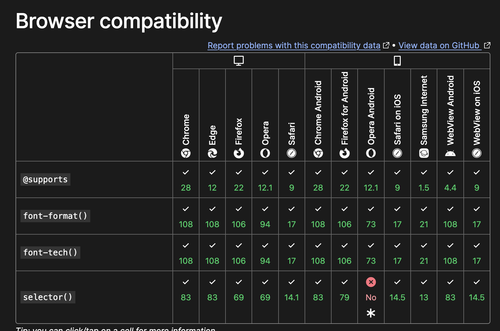

# Interactive functionality

## Browsers en Feature detection 

In Sprint 3 heb je geleerd dat er veel verschillende mensen zijn, en waarom je dus rekening moet houden met _Toegankelijkheid_. In deze sprint leer je dat er ook veel verschillende browsers zijn, en hoe je daar rekening mee kunt houden tijdens het ontwerpen en coderen.


### Aanpak

Afgelopen maandag hebben we ons wat meer verdiept in _Progressive Enhancement_; een coding strategie waarmee je er voor kunt zorgen dat zoveel mogelijk mensen jouw werk kunnen gebruiken. Vandaag gaan we meer leren over _feature detection_ en dit toepassen op de leertaak. Komende vrijdag krijg je hierop een code review.


## Browsers en engines

In het college van vanochtend kwamen onderstaande bronnen langs.

- [Rendering Engine @ MDN](https://developer.mozilla.org/en-US/docs/Glossary/Engine/Rendering)
- [How browser rendering works – behind the scenes](https://blog.logrocket.com/how-browser-rendering-works-behind-scenes/)
- [Timeline of Web Browsers](https://upload.wikimedia.org/wikipedia/commons/7/74/Timeline_of_web_browsers.svg)
- [WorldWideWeb Rebuild](https://worldwideweb.cern.ch/)
- [Lynx](https://lynx.browser.org/)
- [BrowserStack for GitHub Students](https://www.browserstack.com/github-students)


## Feature detection

Progressive Enhancement is een coding strategie, waarbij je je website opbouwd in lagen. Zo zorg je ervoor dat als iets stuk gaat, of als een browser een techniek niet ondersteund, je website terugvalt naar een laag die wel werkt:

1) Bepaal eerst de _core functionality_ van wat je gaat maken
2) Bouw die functionaliteit met de _simpelste techniek_ (meestal HTML, met een klein beetje Mobile First CSS voor de huisstijl)
3) Voeg daarna _extra enhancements_ toe met CSS en client-side JS, om de User Experience te verbeteren (de leukste stap!)

in de 3e laag kun je _feature detection_ gebruiken.
Met _feature detection_ check je of een browser een bepaalde CSS of JS techniek kan uitvoeren. 

### @support in CSS
In CSS kun je voor feature detection `@supports` gebruiken.

Bijvoorbeeld als je een nieuwe techniek `background-clip: text` wil gebruiken, dan kun je met `@support` checken of een browser dit ondersteunt. Zo kan je ervoor zorgen dat de website niet stuk gaat als een browser dit niet ondersteund. Want als je in onderstaand voorbeeld geen feature detection zou toepassen dan kan het gebeuren dat de tekst niet te lezen is.

```css
h1 {
	color: #050542;

	@supports (background-clip: text) {
		background: linear-gradient(to right, #A675F5, #050542);
		background-clip: text;
		color: transparent;
	}
}
```

Zo kun je ook controleren of een bepaalde selector ondersteund wordt:

```css
@supports selector(:has(a)) {
	...
}
```

Of je kunt controleren of custom properties ondersteund worden:

```css
@supports (--custom: properties) {
	...
}
```

### CSS Cascade 
in veel gevallen heb je geen feature detection nodig, vanwege [de _Cascade_ in CSS](https://developer.mozilla.org/en-US/docs/Learn_web_development/Core/Styling_basics/Handling_conflicts#cascade). Door slim gebruik te maken van de _cascade_ zorg je ervoor dat je code simpeler wordt en dat je website niet stuk gaat. Een browser negeert CSS die niet kan worden uitgevoerd en zal zo'n regel dus 'gewoon' overslaan. Wanneer je iets kan oplossen met de cascade doe dit dan!

```css
h1 {
	color: #ff0000;
	color: color(display-p3 1 0.08 0); /* super red! */;
}
```
Bijvoorbeeld: Bepaal eerst de kleur in hex en daarna met de `color()` function en het nieuwe kleurenchema `display-P3`. Als een browser dit niet kent zal het die regel negeren, maar is de kleur wel rood. Kan een browser het wel uitvoeren? Dan is de kleur super rood!


#### Bronnen

Om meer te leren over wat mogelijk is met feature detection kan je deze bronnen lezen: 
- [Implementing feature detection @ MDN](https://developer.mozilla.org/en-US/docs/Learn_web_development/Extensions/Testing/Feature_detection)
- [@supports in CSS @ MDN](https://developer.mozilla.org/en-US/docs/Web/CSS/@supports)


### Browser features
Op MDN kun je van elke browser feature ook zien hoe de ondersteuning is. Hiermee kun je inschatten wat je strategie voor Progressive Enhancement moet worden, en hoe je je werk kunt testen


_Op MDN staat welke browsers een bepaalde techniek ondersteunen._


## Opdracht
💪 In JavaScript kun je ook een aantal patronen gebruiken om _feature detection_ toe te passen. Vooral volgende week gaan we hiermee aan de gang, maar mocht je al _client-side_ JavaScript gebruiken, onderzoek dan ook deze patronen.

👉 Pas feature detection toe op de opdracht uit de leertaak. Installeer zoveel mogelijk browsers waarmee je kunt testen. Test je werk met (oudere) browsers die andere features ondersteunen, zoals Lynx en apparaten uit het device lab. Probeer BrowserStack uit met een GitHub student account. Maak issues van je bevindingen, en onderzoek oplossingen. En los deze ook op. Misschien moet je je core functionaliteit wel opnieuw uitschetsen hiervoor? Misschien moet je wel een extra stap (terug) maken in je HTML?


### Bronnen

- [Feature detection in JavaScript @ MDN](https://developer.mozilla.org/en-US/docs/Learn_web_development/Extensions/Testing/Feature_detection#javascript)
- [Progressive Enhancement @ MDN](https://developer.mozilla.org/en-US/docs/Glossary/Progressive_Enhancement)
- [Progressive Enhancement Resources](https://github.com/voorhoede/progressive-enhancement-resources)
- [Can I Use...](https://caniuse.com/)
