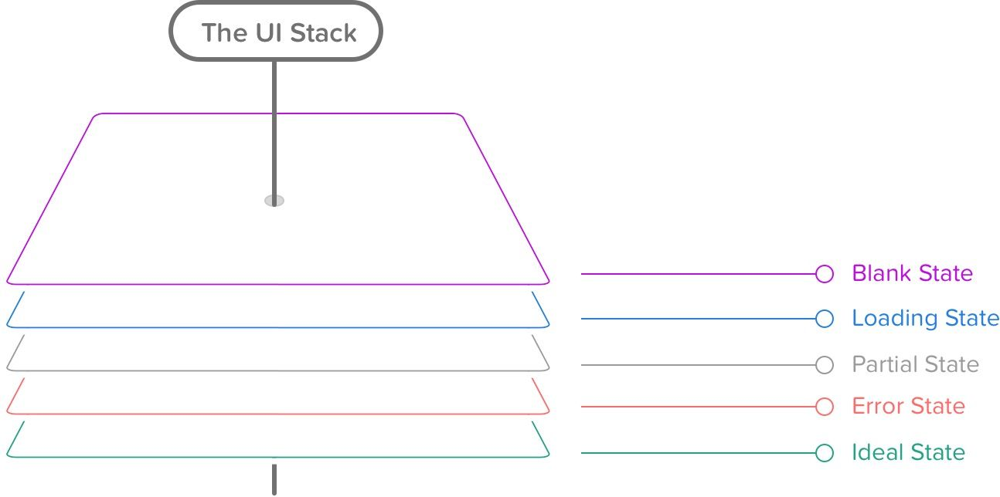

# Interactive functionality

## UI states voor POST interactie

Over het ontwerpen en bouwen verschillende states van de UI-Stack.

### Aanpak

Als je een interactie ontwerpt moet je voor de gebruiker feedback ontwerpen. Je weet dat je met feedback en feedforward ervoor kan zorgen dat gebruikers weten wat ze moeten doen. Dit doe je o.a. met de juiste labels, teksten en button states.  

Als je een POST interactie ontwerpt moet je in de interface nog andere states ontwerpen. Het kan zijn dat er nog geen data is, dat er data geladen wordt, of dat er iets fout gaat. Hiervoor gebruiken we de UI-Stack... Eerst ga je onderzoeken wat states en de UI-Stack zijn, daarna ga je de states ontwerpen en bouwen. 

## UI-Stack

Voor het ontwerpen van states met dynamische data gebruiken we de UI-Stack. 
In het artikel How to Fix a Bad Interface staat:

> Every screen you interact with in a digital product has multiple personalities.
> 
> [How to fix a bad user interface](https://www.scotthurff.com/posts/why-your-user-interface-is-awkward-youre-ignoring-the-ui-stack/)

Voor elke scherm waar een gebruiker iets mee doet moet je verschillende states tonen. Er wordt bijvoorbeeld data geladen, of er kan iets mis gaan. Dan heeft de gebruiker feedback nodig die duidelijk maakt wat er gebeurt. Hiervoor heeft een scherm soms wel 5 of 6 states nodig. 

1. Loading State
2. Partial State
3. Error State
4. Ideal state

en 

5. Empty State, als er nog niets is gepost
6. Succes State, als een post is gelukt

 *verschillende states van dezelfde pagina.*

### Opdracht

Onderzoek met je tafel de 5 states van de UI-Stack:

👉 Schrijf de 5 UI-Stack states op het bord

👉 Zoek voor elke state een goed voorbeeld, heb je ook voorbeelden waar het niet goed gaat?

👉 Schrijf kort op waar ze voor gebruikt worden

👉 Bespreek met je tafel welke UI-stack states je kan gebruiken voor jouw `post` interactie

## UI-Stack ontwerpen en bouwen

Om de UI-Stack toe te passen ga je eerst de states ontwerpen, zodat je precies weet wat je wilt bouwen. Hiervoor ga je je Wireflow uitbreiden. 

### Wireflow uitbreiden met de UI-Stack

Bespreek je Wireflow over je POST funcionaliteit met je buur en bedenk welke states van de UI-Stack je nodig hebt. Wat laat je bijvoorbeeld zien als er nog geen berichten zijn gepost? Wat zou er mis kunnen gaan met posten en wat voor feedback geef je dan aan de gebruiker? En wat ziet een gebruiker als de POST goed gaat?

Voeg de states toe en geef ze een duidelijke titel en korte uitleg.

<!--
👉 Breid je wireflow uit met elke UI state
-->

### UI-Stack states bouwen in Liquid

Omdat we server-side pagina's aan het bouwen zijn, gaan we beginnen met het bouwen van een empty-state. De loading-state heb je pas nodig als je de POST client-side gaat maken in week 3 van deze sprint (de 3e laag van Progressive Enhancement).

Om de empty-state te kunnen tonen in Liquid zul je gebruik moeten maken van _if/else statements_. Welke HTML moet gerenderd worden als er geen data is? Welke HTML moet gerenderd worden als er wel data gePOST is? 

👉 Schrijf bij de Wireflows pseudo-code hoe je die state kan bouwen. Kijk in de Liquid documentatie welke tags en filters je zou kunnen gebruiken om een empty state te maken en schrijf ze op het bord

👉 Als je het ontwerp en pseudo-code bedacht hebt, kan je proberen de states te bouwen. Vrijdag gaan we de states testen en/of elkaar helpen met de volgende stap.

💪 Maak de UI states in [partials](https://shopify.github.io/liquid/tags/template/#render)

### Bronnen

- [UI-Stack - How to fix a bad user interface](https://www.scotthurff.com/posts/why-your-user-interface-is-awkward-youre-ignoring-the-ui-stack/)
- [Shopify Liquid documentatie](https://shopify.github.io/liquid/)
- [Officiele Liquid documentatie](https://liquidjs.com/index.html)
